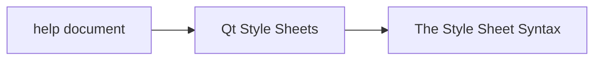
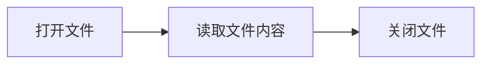
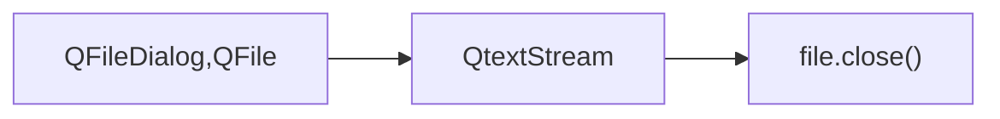
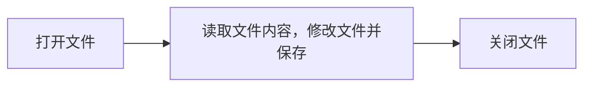

[TOC]
---
# 文本编辑器
---
## 1.项目概述
### 1.1功能介绍
- 可以实现打开、保存、关闭功能
- UI界面美化
- 添加打开快捷键，添加保存快捷键
- 底部显示行列号，和编码方式
- Ctrl + "+"实现字体放大，Ctrl + "-"实现字体缩小  
   Ctrl + "滚轮"实现字体的放大缩小
- 实现光标行高亮   
---
### 1.2界面实现预览


---
### 1.3界面设计简要介绍
**本项目使用的是Qt5.12.0，QtCreator GUI编程。选择Widget，wingw64位。**

- Widget的窗口图标和标题自行设计
- 打开，保存，关闭的样式借助ui编程的样式表
- 中间计录文本的部件是一个textEdit
- 下面记录行列号的是一个Label，编码方式选择的是一个combo Box
- 灰色背景也是借助样式表
---
## 2.设计流程
---
### 2.1窗口图片，和标题更改

### 2.1.1gui方式改变
1. 前提是要添加Qt Resource 文件，将图片文件保存Ctrl+"s"。
2. 点击.ui文件


在上面画线处修改。

### 2.1.2代码方式更改
*示例*
```c++
    setWindowTitle("nihao");//改标题 
    QPixmap pix("E:/QT_Example/QtLiangxu/37-notebookUI/icon/note.png");
    QIcon icon(pix);
    setWindowIcon(icon);//改图标
 ```
 

 ---
 

### 2.2 QPushButton按钮设置样式表
 
查看帮助文档：



在The Style Sheet Syntax 里会看到一些示例。


这三行分别表示鼠标不在按钮上时的图标状态，鼠标移动到按钮上图标状态，鼠标点击按钮时的图标状态。

---

## 2.2 功能实现
 
- 文件读取功能
- 文件保存功能，创建快捷键
- 文件关闭功能，创建快捷键
- 关闭按钮弹出消息框功能
- 文本放大缩小功能
- 文本光标所在行高亮
- 状态栏：行号，列号
- 更改编码方式

### 2.2.1 打开读取文件






``` c++
//打开文件功能
void Widget::on_btnOpen_clicked()
{
    //打开
    QString fileName = QFileDialog::getOpenFileName(this,tr("Open File"),
                                                    "E:/QT_Example/QtLiangxu/37-notebook002",
                                                    tr("Text(*.txt)"));
    ui->textEdit->clear();  //在打开文本之前先清空ui界面的textEdit
    file.setFileName(fileName);     //打开的文件是fileName获取的路径文件
    if(!file.open(QIODevice::ReadWrite | QIODevice::Text)){
        qDebug()<<"File open error.";
    }
    this->setWindowTitle(fileName + " -MyNoteBook");//这里是实现窗口标题的改变，知道打开的是那个文件
    //读取
    QTextStream in(&file);
    //in.setCodec("UTF-8"); 不在手动输入
    //将ui->comboBox->currentText()转换为char
    QString str = ui->comboBox->currentText();
    const char *cstr = str.toStdString().c_str();//先转换成c++的string再转成char*
    //std::cout<<cstr;
    in.setCodec(cstr);//需要传进去char*的变量
    while(!in.atEnd()){
        QString context = in.readLine();    //一行一行读取
        ui->textEdit->append(context);
    }
    //关闭，，，以增加了关闭功能
    //file.close();
}
```

---
### 2.2.2 打开保存文件




```c++
//保存文件功能
void Widget::on_btnSave_clicked()
{
    if(!file.isOpen()){
        //打开文件
        QString fileName = QFileDialog::getSaveFileName(this,tr("Save File"),
                                                        "E:/QT_Example/QtLiangxu/37-notebook002",
                                                        tr("Text(*.txt)"));
        file.setFileName(fileName);
        if(!file.open(QIODevice::ReadWrite | QIODevice::Text)){
            qDebug()<<"File open error.";
        }
        this->setWindowTitle(fileName + " -MyNoteBook");//这里是实现窗口标题的改变，知道打开的是那个文件

    }
    //写入文件
    QTextStream out(&file);
    QString str = ui->comboBox->currentText();
    const char *cstr = str.toStdString().c_str();//先转换成c++的string再转成char*
    out.setCodec(cstr);
    //out.setCodec("ANSI");

    QString content = ui->textEdit->toPlainText();//将ui的textEdit的文本返回给QString变量
    out<<content;
    //关闭文件，，，已增加了关闭功能
    //file.close();
}
```
 
QString QTextEdit：：toPlainText（） 常量以纯文本形式返回文本编辑的文本。注意：属性 plainText 的 Getter 函数。参见 QTextEdit：：setPlainText（）。

---

### 2.2.3 文件关闭

这个弹框功能在QMessageBox的帮助文档里有示例。
```c++
//关闭文件功能
void Widget::on_btnClose_clicked()
{
    QMessageBox msgBox;
    int ret = QMessageBox::warning(this, tr("MyNoteBook Close"),
                                   tr("The document has been modified.\n"
                                      "Do you want to save your changes?"),
                                   QMessageBox::Save | QMessageBox::Discard
                                   | QMessageBox::Cancel,
                                   QMessageBox::Save);
    // 这里是点击关闭按钮后弹出详细框提供关闭选择 
    switch (ret) {
      case QMessageBox::Save:
          // Save was clicked
          on_btnSave_clicked();
          break;
      case QMessageBox::Discard:
          // Don't Save was clicked
        ui->textEdit->clear();//清空textEdit
        if(file.isOpen()){
            file.close();
            this->setWindowTitle(" -MyNoteBook");
        }
          break;
      case QMessageBox::Cancel:
          // Cancel was clicked
          break;
      default:
          // should never be reached
          break;
    }
}
```

---

### 2.2.4 更改编码方式

```c++
void Widget::on_comboBox_currentIndexChanged(int index)
{
    //切换编码后，重新读取
    //qDebug()<<index;

    ui->textEdit->clear();  //不管打开还是没打开文件，当comboBox改变时，先清空文本
    if(file.isOpen()){      //打开文件以comboBox现在的编码方式读取文本
        QTextStream in(&file);  
        in.setCodec(ui->comboBox->currentText().toStdString().c_str());
        //因为在打开文件时光标已经在尾部了，要让光标回到头部才能正常运行下面的代码
        //文件的光标回到头,QFile的seek
        file.seek(0);
        while(!in.atEnd()){
            QString context = in.readLine();
            ui->textEdit->append(context);
        }
    }
}
```
- void QTextEdit::append(const QString &text):将带有文本的新段落追加到 TextEdit 的末尾。
- [virtual] bool QIODevice::seek(qint64 pos):
对于随机访问设备，此函数将当前位置设置为 pos，成功时返回 true，如果发生错误则返回 false。对于顺序设备，默认行为是生成警告并返回 false。

---

### 2.2.5 textEdit光标位置，和当前行高亮

- 需要用到textEdit的信号cursorPositionChanged()。

- QTextCursor QTextEdit::textCursor() const：
返回表示当前可见游标的 QTextCursor 的副本。请注意，对返回的游标的更改不会影响 QTextEdit 的游标;使用 setTextCursor（） 更新可见光标。

- 设置当前行高亮需要用到结构体ExtraSelection： 
```c++ 
struct ExtraSelection
{
    QTextCursor cursor;
    QTextCharFormat format;
};
```
- QList<QTextEdit::ExtraSelection> extraSelections;:来存放QTextEdit::ExtraSelection的变量。
- QBrush:来获取颜色样式

```c++
//实现光标位置更新的功能
void Widget::onCursorPositionChanged()
{

    QTextCursor cursor=ui->textEdit->textCursor();
    //qDebug()<<cursor.columnNumber() + 1<<" ;"<<cursor.blockNumber() + 1;//lie hang
    QString blockNum = QString::number(cursor.blockNumber());   //number()将整形转换为QString型
    QString columnNum = QString::number(cursor.columnNumber());
    const QString labelMes = "L:"+blockNum+"   C:"+columnNum;
    ui->labelPosition->setText(labelMes);

    //设置当前行高亮
//    struct ExtraSelection
//    {
//        QTextCursor cursor;
//        QTextCharFormat format;
//    };
    QList<QTextEdit::ExtraSelection> extraSelections;
    QTextEdit::ExtraSelection ext;

    //1.知道当前行
    ext.cursor = ui->textEdit->textCursor();

    QBrush qBrush(Qt::yellow);
    //2.颜色
    ext.format.setBackground(qBrush);
    //配置属性，整行显示，没有这句话不行
    ext.format.setProperty(QTextFormat::FullWidthSelection, true);
    //3.设置
    //把ext加到容器里
    extraSelections.append(ext);
    ui->textEdit->setExtraSelections(extraSelections);
}
```

---

### 2.2.6 快捷键

```c++
    QShortcut *shortOpen = new QShortcut(QKeySequence(tr("Ctrl+O", "File|Open")),this);
    QShortcut *shortSave = new QShortcut(QKeySequence(tr("Ctrl+S", "File|Save")),this);
    QShortcut *shortZoomIn = new QShortcut(QKeySequence(tr("Ctrl+=", "File|Save")),this);
    QShortcut *shortZoomOut = new QShortcut(QKeySequence(tr("Ctrl+-", "File|Save")),this);

    connect(shortOpen,&QShortcut::activated,[=](){
        on_btnOpen_clicked();
    });

    connect(shortSave,&QShortcut::activated,[=](){
        on_btnSave_clicked();
    });

    connect(shortZoomIn,&QShortcut::activated,[=](){
        zoomIn();
    });

    connect(shortZoomOut,&QShortcut::activated,[=](){
        zoomOut();
    });
    


void Widget::zoomIn()
{
    //获取textEdit字体信息
    QFont font = ui->textEdit->font();
    //获取当前字体的大小
    int fontSize = font.pointSize();
    if(fontSize == -1) return ;

    //改变字体大小，并设置字体大小
    int newFontSize = fontSize + 1;
    font.setPointSize(newFontSize);
    ui->textEdit->setFont(font);
}


void Widget::zoomOut()
{
    //获取textEdit字体信息
    QFont font = ui->textEdit->font();
    //获取当前字体的大小
    int fontSize = font.pointSize();
    if(fontSize == -1) return ;

    //改变字体大小，并设置字体大小
    int newFontSize = fontSize - 1;
    font.setPointSize(newFontSize);
    ui->textEdit->setFont(font);
}

```
---

### 2.2.7 ctrl + 滚轮实现放大缩小功能

- 新建一个类，需要重写事件：
```c++
protected:
    void wheelEvent(QWheelEvent *e) override;   //滚轮事件
    void keyPressEvent(QKeyEvent *e) override;  //键盘按下事件
    void keyReleaseEvent(QKeyEvent *e) override;//键盘施放事件
private:
    bool ctrlkeyPressed = 0;    //ctrl键按下为true，释放为false
```
- 包含头文件：QWheelEvent
- QPoint QWheelEvent::angleDelta() const：
返回轮子旋转的距离，以八分之一度为单位。正值表示轮子向前旋转，远离用户;负值表示滚轮向用户向后旋转。

- void QEvent::accept():
设置事件对象的 accept 标志，相当于调用 setAccepted（true）。
设置 accept 参数表示事件接收器需要该事件。不需要的事件可能会传播到父小组件。
**事件一层一层传下去，事件处理了就调用accept就结束了；ignore是将事件往外放，如果放到在最外面（最大的控件）还往外放就不处理这个事件。**

```c++
void MyTextEdit::wheelEvent(QWheelEvent *e)
{
    //这一步还要将ui界面的textEdit提升为MyTextEdit
    //qDebug()<<e->angleDelta().y();
    if(ctrlkeyPressed == 1){
        if(e->angleDelta().y() > 0){
            zoomIn();
        }else if(e->angleDelta().y() < 0){
            zoomOut();
        }
        e->accept();//事件处理完毕
    }else{
        //如果ctrl没按下就不执行放大缩小，，按照滚轮的之前的功能运行
        QTextEdit::wheelEvent(e);
    }

}

void MyTextEdit::keyPressEvent(QKeyEvent *e)
{
    //用ctrl控制避免 字体随着滚轮滑动变化
    if(e->key() == Qt::Key_Control){
        ctrlkeyPressed = 1; //ctrl按下
    }
    QTextEdit::keyPressEvent(e);
}

void MyTextEdit::keyReleaseEvent(QKeyEvent *e)
{
    if(e->key() == Qt::Key_Control){
        ctrlkeyPressed = 0; //ctrl松开
    }
    QTextEdit::keyReleaseEvent(e);
}

```
---
### 2.2.8 事件过滤来实现Ctrl+滚轮放缩文字

在Qt的事件处理过程中，引入事件过滤器（Event Filter）可以让你在事件达到目标对象之前进行拦截和
处理。这是一种强大的机制，允许你在不同对象间共享事件处理逻辑或在父对象中集中处理特定事件。

1. 定义事件过滤器: 事件过滤器通常是一个重写了 QObject::eventFilter() 方法的对象。这个方法
会在事件传递给目标对象之前被调用。
2. 安装事件过滤器: 使用 QObject::installEventFilter() 方法安装事件过滤器。这个方法告诉Qt
在将事件发送给特定对象之前先通过过滤器对象。例如，如果你想在父窗口中过滤子窗口的事件，
你需要在父窗口的对象上调用 installEventFilter() ，并将子窗口作为参数传递。
3. 事件过滤器逻辑: 在 eventFilter() 方法内部，你可以编写自定义逻辑来决定如何处理或忽略事
件。如果此方法返回 true ，则表示事件已被处理，不应该继续传递；如果返回 false ，则事件将
正常传递给目标对象。
4. 事件分发: 当事件发生时，Qt首先将事件发送到安装了事件过滤器的对象。在这一步，
eventFilter() 方法被调用。
5. 决定是否传递事件: 根据 eventFilter() 方法的返回值，Qt决定是否继续向目标对象传递事件。如
果过滤器返回 true ，事件处理到此结束；如果返回 false ，事件继续传递到原始目标对象。
6. 目标对象处理事件: 如果事件过滤器允许事件继续传递，目标对象将像没有事件过滤器存在时那样处
理事件

```c++
bool Widget::eventFilter(QObject *watched, QEvent *event)
{

   /* QKeyEvent *keyEvent = (QKeyEvent*)event;
    if(keyEvent->key() == Qt::Key_Control){
        qDebug() << "Ctrl";
    }
    */
    if(event->type() == QEvent::Wheel){
        if(QGuiApplication::keyboardModifiers() == Qt::ControlModifier){

             QWheelEvent *wheelEvent = dynamic_cast<QWheelEvent*>(event);
             if(wheelEvent->angleDelta().y() > 0){
                 zoomIn();
             }else if(wheelEvent->angleDelta().y()<0){
                 zoomOut();
             }
             return true;
        }

        return false;
    }
}
```


 


